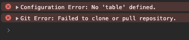
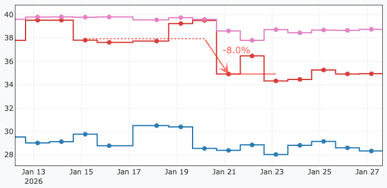
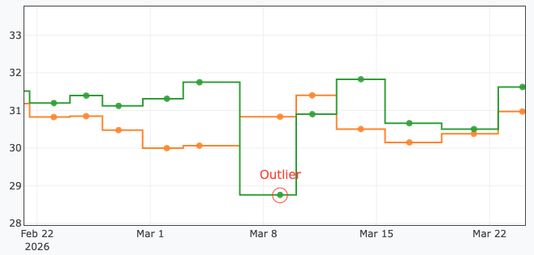
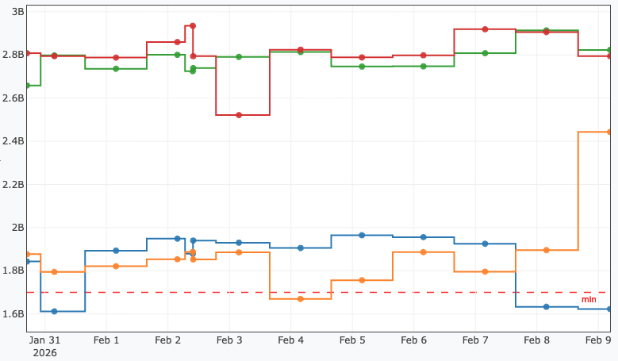
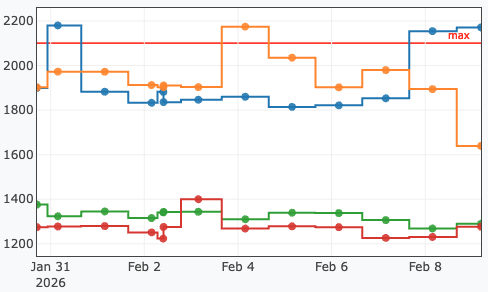

# Configuration Guide

The configuration is defined in YAML file(s) (e.g., `benchmarks.yaml`).
LLview can accept a single file (with one or more benchmarks) or a folder containing many separate YAML files.
See [examples of configuration files here](examples.md).

## 1. Defining the Benchmark and its Sources

On the top-level, you can define a **description** (supports HTML) to document your benchmark.

```yaml
MyBenchmark:
  description: 'General benchmark suite. See <a href="https://example.com">Documentation</a>.'
  host: '...'
  ...
```

LLview collects the data directly from a Git repository (e.g., GitLab).
To indicate from where (and how) the information should be obtained, you have to define the `host` (repository address), a `token` with "read_repo" access at a minimum Reporter level, and optionally a `branch` where the results are stored.
Then, the `folders` or `files` list should be given as `sources` (also accepting regex patterns).

```yaml
MyBenchmark:
  # Git Repository Configuration
  host: 'https://git.example.com/project/benchmarks.git'
  branch: 'main'          # (Optional) Branch where result files are committed. Default: main
  token: "<token>"        # Access Token (requires read_repo / reporter level)

  # File Collection Rules (Applied inside the repo)
  # At least one of 'folders' or 'files' must be provided.
  sources:
    folders:
      - 'Results/'        # Recursively scans these folders in the repo
    files:                # Specific files or patterns to match
      - '.*\.csv'
    include: '.*_gcc_.*'  # (Optional) Regex: Only process files matching this pattern
    exclude: '.*_tmp.*'   # (Optional) Regex: Ignore files matching this pattern
```

## 2. Defining Metrics

The `metrics` section defines every data point you want to track. A metric can be obtained from the file content, filename, metadata, or calculated from other metrics.

```yaml
  metrics:
    # 1. From CSV Content (Default)
    # If 'header' is omitted, the key name ('mpi-tasks') is used as the CSV header.
    mpi-tasks:
      type: int
      header: 'MPI Tasks'
      description: 'Number of MPI Tasks used' # Shows as tooltip in the table header

    # 2. From Filename (using Regex)
    Compiler:
      from: filename
      regex: '.*_(gcc|intel)_.*'
      description: 'Compiler used for the build'

    # 3. From Metadata
    # Looks for a JSON object in comment lines inside the file (e.g. # {"job_id": 1234})
    # Note: Only top-level keys in the JSON structure are supported.
    JobID:
      from: metadata
      key: 'job_id'
      type: int
      description: 'Slurm Job ID'

    # 4. Derived Metrics (Formulas & Aggregations)
    # A. Horizontal Formulas: Calculate values based on **other metrics** in the same row.
    # Supported operators: +, -, *, /
    # Headers must be quoted if they contain spaces or special characters.
    Efficiency:
      type: float
      from: "'Performance' / 'Peak_Flops'"
      unit: '%'
      description: 'Calculated efficiency ratio'

    # B. Vertical Aggregations: Aggregate values across multiple rows of the **same metric** that share 
    # the same timestamp and table parameters. 
    # Supported methods: sum, min, max, avg
    sum_frequencies:
      from: Frequency
      aggregation: sum
      type: float

    # C. Formula Chaining: Aggregated metrics can be seamlessly used in downstream formulas.
    one_minus:
      from: "1 - 'sum_frequencies'"
      type: float
```

!!! Info "Aggregations and Filters"
    If you apply `include` or `exclude` filters to a metric, the aggregation is evaluated securely. Rows that are destined to be filtered out are automatically excluded from the mathematical calculation, ensuring your sums and averages remain perfectly accurate.

!!! Warning
    Due to internal manipulation of the tables and databases, the following keys are forbidden (case-insensitive):
    `dataset`, `name`, `ukey`, `lastts_saved`, `checksum`, `status`, `mts`

### Metric Options Reference

| Option | Description |
| :------ | :--- |
| `type` | (Optional) Data type. Options: `str` (default), `int`, `float`, `ts` (timestamp), `date`. |
| `from` | (Optional) Source of data. Options: `content` (default), `filename`, `metadata`, `static`. If containing math operators, it acts as a formula. If used with `aggregation`, it specifies the target metric to aggregate. |
| `aggregation` | (Optional) Method used to summarize values across multiple entries of the metric sharing the same timestamp. Options: `sum`, `min`, `max`, `avg`. |
| `header` | (Optional) The column name in the CSV. Defaults to the metric key name if omitted. |
| `key` | (Required for `from: metadata`) The key name in the JSON metadata. |
| `regex` | (Required for `from: filename`) Regular expression to extract data from filenames. |
| `default` | (Optional) A specific value to use if the metric is missing or empty in the source. If set, missing data will **not** trigger a "Failed" status. |
| `unit` | (Optional) String to display in graph axis labels (e.g., 'ns/d', 'GB/s'). |
| `description` | (Recommended) Brief text describing the metric. Used as a tooltip in the table. |
|  <span style="white-space:nowrap">`include`/`exclude`</span> | (Optional) List of values or Regex patterns to filter specific data rows based on this metric. |
| `validate` | (Optional) A list of validation rules (e.g., regressions, outliers, min/max ranges) to automatically flag anomalies. See **[Data Validation](#6-data-validation)**. |


## 3. Dashboard Structure & Status

LLview generates a hierarchy of views for your benchmarks:

1.  **Global Overview Page:** Lists all configured benchmarks. Columns include Name, First Run Date, Last Run Date, and Counts (Total vs. Valid).
2.  **Benchmark Detail Page:** Shows the summary table and graphs for a specific benchmark.

### Understanding Status & Failures
LLview automatically calculates a `_status` for every data point and uses this to generate the **Status History** sparkline (`...-S-S-F-S-W`) and count valid runs.

*   **S (Successful):** All critical metrics were found, and all validation checks passed.
*   **W (Warning):** All data was found, but a defined metric validation failed (e.g., a performance regression or outlier was detected).
*   **F (Failed):** A metric required for plotting or a non-string parameter was found to be missing, `NaN`, `None`, or empty.

**How to report failures correctly:**
To ensure failures are tracked in the timeline, your benchmark workflow should generate a result file (e.g., CSV) even if the application crashes.

*   **Correct Approach:** Generate a CSV containing the input parameters (e.g., timestamp, compiler, nodes) but leave the performance metric columns **empty**. LLview will ingest this, mark the run as **FAILED**, and visualize it as a gap in the graph.
*   **Incorrect Approach:** Generating no file at all. LLview cannot track what doesn't exist, so the "Last Status" will remain stale (showing the last successful run).

**Status in the Dashboard:**

*   **Total Runs:** Counts all ingestions (Success + Warning + Failed).
*   **Valid Runs:** Counts `S` and `W` runs.
*   **Status History:** Shows the last 5 runs (Oldest $\to$ Newest). A leading dash `-` indicates more history exists.

### Error Reporting & Console
Configuration and processing errors encountered during data collection (e.g., unreachable repositories, missing metric sources, or invalid validation configurations) are automatically captured and forwarded to the frontend. 

Instead of failing silently, a stub page or tab is generated, and the collected error messages are prominently displayed within an error console on the benchmark dashboard. This ensures rapid identification and resolution of pipeline issues without needing to inspect backend server logs.

<figure markdown>
  { width="370" }
  <figcaption>Example of configuration and pipeline errors forwarded directly to the benchmark dashboard to be shown on the console.</figcaption>
</figure>

## 4. Aggregation & Visualization

This section controls how the raw data defined in `metrics` is grouped, aggregated, and displayed on the dashboard.

### The `table` Section (Aggregation)
The metrics listed here will define the **columns** of the summary table on the Benchmark Page.

*   **How it works:** Each unique combination of values for these metrics generates one distinct, selectable row.
*   **Best Practice:** Use input parameters (e.g., `System`, `Nodes`, `Compiler`).
*   **Warning:** Do **not** put unique identifiers (like `JobID` or `Timestamp`) here. If you do, the grouped history graphs will contain only a single point per curve, defeating the purpose of a continuous benchmark. Instead, put these identifiers in the **`annotations`** field of the plots.

```yaml
  table:
    - System
    - Nodes
    - Compiler
    # Result: One row for "Cluster-A / 4 Nodes / GCC", another for "Cluster-A / 8 Nodes / Intel", etc.
```

### The `plots` and `plot_settings` Sections (Visualization)

You can define global defaults using `plot_settings` and specific graph definitions using the `plots` list. Settings follow an inheritance hierarchy: **Global < Local**.

```yaml
  # Global Settings (Inherited by all plots)
  plot_settings:
    group_by: [Stage, Modules]
    annotations: ['JobID', 'CommitHash']
    colors:
      colormap: 'Set1'
    styles:
      mode: 'lines+markers'
    layout:
      legend:
        xanchor: "center"
        x: 0.5
        y: 1

  # Plot Definitions
  plots:
    # Plot 1: Inherits all global settings
    - x: ts
      y: 'Bandwidth Copy'
    
    # Plot 2: Overrides global settings locally
    - x: ts
      y: 'Bandwidth Scale'
      group_by: [System] 
      styles:
        marker: { size: 10 }
```

### Plot Settings Reference

The following keys can be used inside `plot_settings` (globally) or inside a specific item in `plots` (locally).

| Key | Sub-Key | Description | Default / Options |
| :--- | :--- | :--- | :--- |
| **`group_by`** | | List of metrics used to split data into different curves. | `[]` (Single curve) |
| <span style="white-space:nowrap">**`annotations`**</span> | | List of metrics to display in the tooltip when hovering over data points. | `[]` |
| **`colors`** | `colormap` | Name of the Matplotlib/Plotly colormap to use. | `'tab10'` |
| | <span style="white-space:nowrap">`sort_strategy`</span> | Order in which colors are assigned to traces. Options: `'standard'`, `'reverse'`, `'interleave_even_odd'` | `'standard'` |
| | `skip` | List of HEX color codes to exclude from the colormap. | `[]` |
| **`styles`** | | Dictionary of style properties passed directly to the [Plotly.js Scatter trace](https://plotly.com/javascript/reference/scatter/). | `type: scatter`<br>`mode: markers`<br>`marker: { opacity: 0.9, size: 5 }` |
| **`layout`** | | Dictionary of layout options passed directly to [Plotly.js Layout object](https://plotly.com/javascript/reference/layout/). | `yaxis: {title: Metric name [units]}`<br>`xaxis: {title: Metric name [units]}` (if not date)<br>`legend: {x: 1.02, xanchor: left, y: 0.98, yanchor: top, orientation: v}` |

## 5. Structuring Benchmarks (Tabs)

For complex benchmarks, you can split the views using Tabs.

### A. Benchmark Tabs (Page Level)
Splits the entire page (Table + Footer). This is intended for a single benchmark application that supports different **execution modes** requiring completely different input parameters (columns).

*   **Usage:** Define a `tabs:` dictionary under the root benchmark.
*   **Inheritance:** Configuration defined at the **Root** level (Host, Token, `plot_settings`, etc.) is automatically inherited by the tabs unless explicitly overwritten inside the tab.

### B. Footer Tabs (Graph Level)
Splits the graphs area into visual tabs. This is useful for organizing many plots (e.g., separating "Performance" graphs from "System Usage" graphs).

*   **Usage:** Instead of a list, `plots` becomes a dictionary where keys are the tab names.

```yaml
  plots:
    tabs:
      Performance:    # Tab Name
        - x: ts
          y: 'Throughput'
      Runtime:        # Tab Name
        - x: ts
          y: 'Total Runtime'
```

## 6. Data Validation

LLview supports an extensible validation framework to automatically flag anomalous data points, such as performance regressions or transient system spikes. Validation is performed mathematically on a per-curve basis, ensuring that distinct traces (e.g., 2 Nodes vs. 4 Nodes) are evaluated independently against their own baselines.

If a validator flags a data point as an anomaly, the underlying run's status is automatically marked as **'W' (Warning)**. Runs that are already marked as **'F' (Failed)** due to missing data are ignored by the validation logic.

To enable validation, a `validate` list is added to any metric definition. Multiple validators can be stacked.

### A. Detecting Regressions (`regression_detector`)
A highly robust, nonparametric method is utilized to detect permanent, sustained shifts in performance (regimes). Rather than using static thresholds, a dual-baseline approach inspired by modern CI/CD benchmarking platforms like [Apache Otava](https://otava.apache.org/docs/math) (formerly known as DataStax Hunter) is implemented.

The methodology isolates true performance changes from inherent system noise by calculating effect sizes via the Median Absolute Deviation (MAD)[^1]. This eliminates the need to assume normal distributions and prevents singular outliers from shifting the baseline.

When a regression is confirmed, visual markers are automatically appended to the graph, including a box making the region, dashed lines tracking the previous baseline, solid lines representing the degraded baseline, and an arrow indicating the percentage drop.

<figure markdown>
  { width="800" }
  <figcaption>Example of a detected regression, highlighting the old and new baselines along with the percentage shift.</figcaption>
</figure>

```yaml
metrics:
  GF Total:
    type: float
    header: 'GF_Total'
    validate:
      - name: regression_detector
        direction: higher_is_better # Required. Options: lower_is_better, higher_is_better
        min_change_pct: 5.0         # (Optional) Ignores mathematical shifts smaller than this percentage. Default: 5.0
        effect_size_threshold: 1.5  # (Optional) Statistical strictness against natural noise variance. Default: 1.5
        eval_window: 3              # (Optional) Consecutive runs required to confirm a permanent shift. Default: 3
        start_ts: 1717200000        # (Optional) Forces the baseline calculation to begin from this timestamp (useful after intentional performance improvements)
```

### B. Detecting Outliers (`outlier_detector`)
A rolling-window detector is provided to flag transient, singular spikes often caused by noisy network states or localized node failures. 

Similarly to the regression detector, the Median Absolute Deviation (MAD) is utilized to calculate modified Z-scores (often referred to as robust Z-scores)[^2]. This prevents sequential outliers from blinding the detector, which is a common failure of traditional mean and standard-deviation approaches. Flagged points are visually circled in red with an 'Outlier' label.

<figure markdown>
  { width="800" }
  <figcaption>Example of a detected outlier, visually circled on the graph.</figcaption>
</figure>

```yaml
metrics:
  GF Total:
    type: float
    validate:
      - name: outlier_detector
        window: 10              # (Optional) Size of the rolling window used to establish the local norm. Default: 10
        threshold: 5.0          # (Optional) Deviation multiplier (Z-score) required to flag the point. Default: 5.0
        noise_floor_pct: 1.0    # (Optional) Minimum percentage variance enforced to prevent false positives in overly stable datasets. Default: 1.0
```

### C. Static Thresholds (`range_validator`)
Values falling outside explicitly defined boundaries are flagged. Visual threshold lines representing the `min` and `max` configurations are drawn across the plot.

<div style="display: flex; gap: 20px; flex-wrap: wrap;">
  <figure markdown style="flex: 1; min-width: 300px;">
    
    <figcaption>Example of a minimum threshold, represented by a dashed red line.</figcaption>
  </figure>

  <figure markdown style="flex: 1; min-width: 300px;">
    
    <figcaption>Example of a maximum threshold, represented by a solid red line.</figcaption>
  </figure>
</div>

```yaml
metrics:
  Frequency:
    type: float
    validate:
      - name: range_validator
        min: 30                 # (Optional) Values below this threshold trigger a Warning
        max: 980                # (Optional) Values above this threshold trigger a Warning
```

### D. Developer API: Creating Custom Validators
Custom validation logic can be authored in Python and integrated directly into the LLview pipeline. The function signature must adhere to the following contract:

```yaml
    validate:
      - name: my_custom_validator
        module: my_analysis_package.stats
        method: z_score
```

*   **`name`**: The name of the Python function to call.
*   **`module`**: (Optional) The Python module where the function is defined.
    *   If omitted, LLview looks for a built-in function (e.g., `range_validator`).
    *   If provided, the module must be importable (i.e., inside your `$PYTHONPATH`).
*   **Parameters**: Any additional keys provided under the validator name are passed to the function via the `params` dictionary.

```python
from typing import Tuple, List, Dict, Any, Union

def my_custom_validator(values: List[Union[float, int, None]], params: Dict[str, Any], x_values: List[Any] = None) -> Tuple[List[bool], Dict[str, Any]]:
    """
    Args:
        values: A list containing the metric value for a specific plotting curve.
                Values may be None. The list is guaranteed to be chronologically sorted.
        params: The dictionary of configuration parameters from the YAML 'validate' entry.
        x_values: An optional list containing the x-axis coordinates for each value,
                  used for aligning visual annotations on the plot.

    Returns:
        A tuple containing:
        - List[bool]: True if the value is normal/valid. False if anomalous (Triggers 'W' status).
        - Dict[str, Any]: A Plotly layout additions dictionary containing 'shapes' and 'annotations' arrays.

    Raises:
        ValueError/TypeError: If configuration parameters are invalid. 
                              This halts benchmark processing and logs the error.
    """
    # Example Logic
    threshold = params.get('threshold', 10)
    results = []
    
    for v in values:
        if v is None: 
            results.append(True) # Missing data is ignored securely
        else:
            results.append(v < threshold)
            
    # Optional layout additions (Annotations/Shapes) can be returned to highlight points on the graph
    layout_additions = {'shapes': [], 'annotations': []}
    
    return results, layout_additions
```

***

[^1]: C. Leys, C. Ley, O. Klein, P. Bernard, and L. Licata, *Detecting outliers: Do not use standard deviation around the mean, use absolute deviation around the median.* Journal of Experimental Social Psychology 49, 764-766 (2013).
[^2]: B. Iglewicz, and D. C. Hoaglin, *How to detect and handle outliers.*, ASQC Basic References in Quality Control 16 (1993).